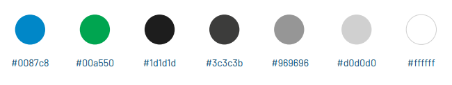
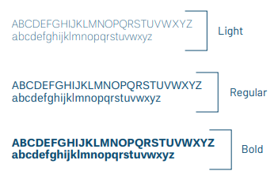

# Guia de Estilo

Um guia de estilo é um documento que tem como principal objetivo apresentar de maneira clara e concisa as diretrizes gerais de design de um projeto, incluindo elementos como fontes, cores e outros aspectos relevantes.

Este guia de estilo segue as diretrizes fornecidas pela Universidade de Brasília (UnB) em seus próprios projetos.

## 1. Elementos

### 1.1 Cores

### 1.2 Icones

### 1.3 Tipografia

## 2. Versionamento do Documento

| Data | Versão | Descrição | Autor |
| :-----: | :-------------: | :---------------: | :-: |
| 27/08/2024 | 1.0 | Versão inicial do documento | [Gabriel Roger Amorim da Cruz](https://github.com/GabrielRoger07) |