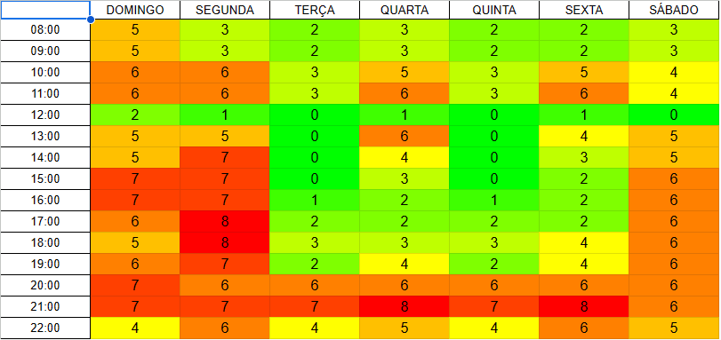

# Plano de Comunicação Interna e Externa

## 1. Introdução

Esse documento busca apresentar como o grupo se planejou em relação a comunicação que ocorrerá durante o semestre. Serão esclarecidos os planos para comunicações internas e externas. Além disso, as ferramentas de comunicação são apresentadas.

## 2. Mapa de Calor

Em ordem do grupo saber os melhores horários de disponibilidade para encontros do grupo, um mapa de calor foi feito. Com isso, foi possível definir quando as principais reuniões do grupo aconteceriam. O mapa de calor pode ser visto pela imagem abaixo:

Basicamente, quanto mais vermelho um horário, maior disponibilidade o grupo tem com ele. Por outro lado, quanto mais verde, menos disponibilidade.

## 3. Comunicação Interna

A equipe, seguindo a metodologia ágil Scrum, terá 3 tipos principais de reuniões internas:

1. Planning: planejamento das tarefas da Sprint;
2. Daily: reuniões diárias para discussão do andamento das tarefas diárias;
3. Review + Retrospectiva: revisar o que foi feito durante a Sprint e ter discussões de como ela foi conduzida.

Dessa forma, os horários dessas reuniões foram decididos para acontecer de acordo com a tabela abaixo:

| Reunião | Quando acontece | Membros esperados |
| :-----: | :-------------: | :---------------: |
| Planning | Segunda 21h-22h | Todos de EPS e MDS |
| Daily | Terça 21h-21h15 Quarta 21h-21h15 Quinta 21h-21h15 Sexta 21h-21h15 Domingo 21h-21h15 | Todos de EPS e MDS (com flexibilidade para aparição) |
| Review + Retrospectiva | Segunda 16h-17h | Todos de EPS e MDS |

## 4. Comunicação Externa

As reuniões com o PO (Caio) e o professor (Hilmer) estão, inicialmente, programadas para ocorrerem toda **Quarta às 18h**, com duração esperada de 1h. Todos os membros de EPS e MDS são esperados na reunião.

## 5. Ferramentas

| Ferramenta | Descrição de uso no projeto |
| :--------- | :-------------------------- |
| Discord | Realização das reuniões síncronas e comunicação assíncrona por chat |
| Github | Repositório com issues e documentações |
| Microsoft Teams | Realização de reuniões em que seja importante a gravação |
| WhatsApp | Responsável pela comunicação rápida da equipe interna |
| Zenhub | Acompanhamento da realização do projeto (quadro Kanban), juntamente com Roadmap |

## 6. Versionamento do Documento

| Data | Versão | Descrição | Autor |
| :-----: | :-------------: | :---------------: | :-: |
| 31/03/2024 | 1.0 | Versão inicial com pontos 1 a 5 | [Victor Hugo Oliveira Leão](https://github.com/victorleaoo) |